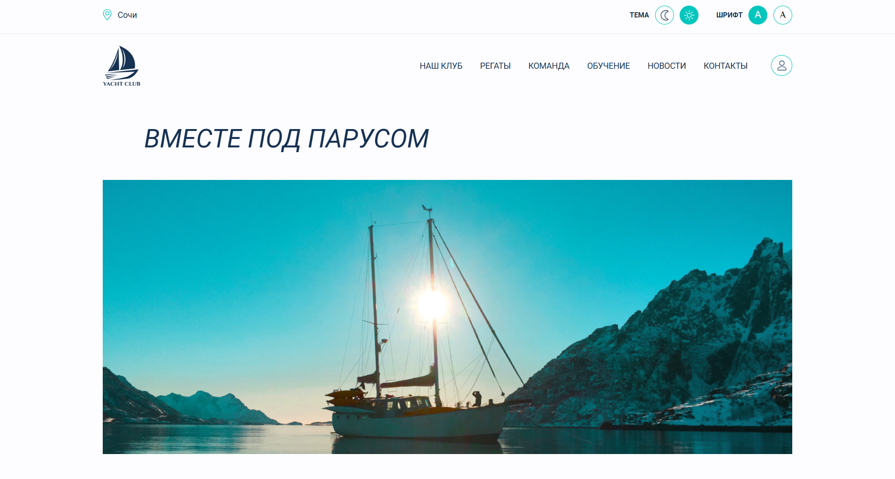

# yacht-club
# 🌐 Личный сайт / Frontend-проект

Простой одностраничный сайт, сделанный с использованием HTML, CSS и JavaScript. Некоторые кнопки навигации не работают, т.к. сайт некоммерчекий и несуществующей компании.

## 📁 Структура проекта
- `index.html` — Главная страница
- `style.css` — Стилизация
- `/js/` — Основные скрипты
- `/img/` — Изображения

## 🛠 Использовано:
- HTML5
- CSS3
- JavaScript (ES6)

## 📸 Превью

## 🚀 Запуск
Открой файл `index.html` в браузере — сайт готов!

## 📌 Автор
[Мария Авдеева](https://github.com/marywwer)
